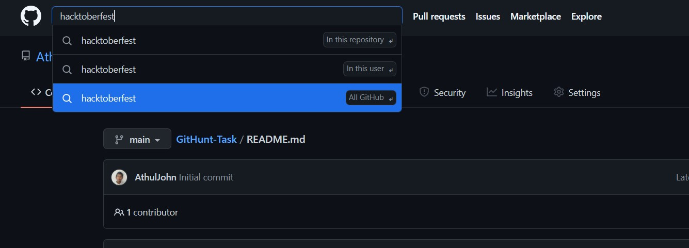
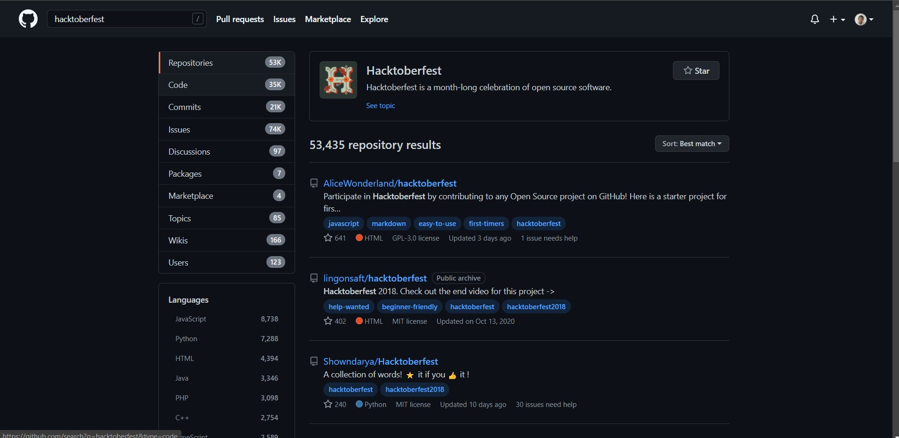

# How to Contribute

So now we have learned about HacktoberFest. Let's discuss how we all can contribute.

Basically there are 3 ways for you to contribute. 

* **Code Contribution**  - Add or implement a new feature    in this repository You can Contribute by adding new codes and your awesome projects in to new folders to this repository or any repository as you wish.

 

* **Solving issues**  - via tags  
  
  
From this repositoruy or any other, select issues tag to resolve particular issues.. 

From the results, you may choose any repository of your interest.

* **Documentation**  - Provide proper documentation for repositories.
 

